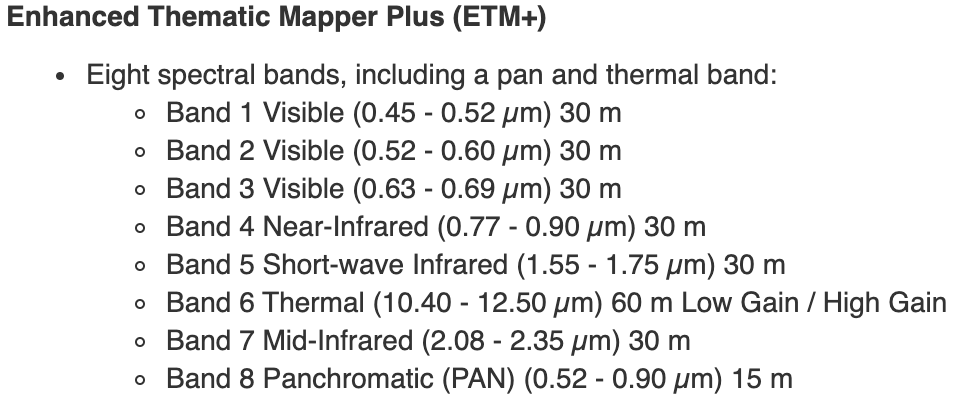
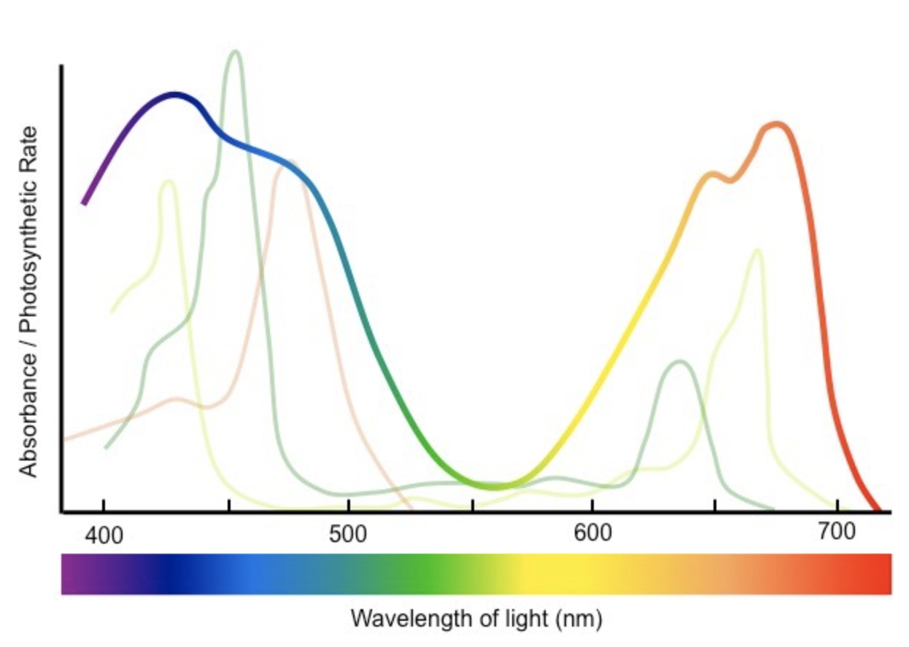
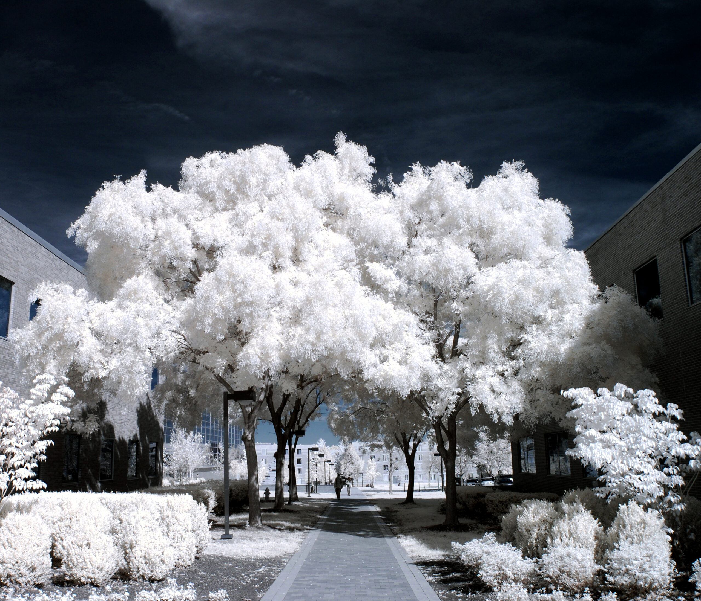

```{r setup, include=FALSE}
knitr::opts_chunk$set(echo = TRUE, message = FALSE, warning = FALSE)

library(raster) ### NOTE: attaching this BEFORE tidyverse
library(tidyverse)
library(here)
library(sf)
library(fasterize)
```

# Rasters

Rasters are discussed in this week's reading, found here: https://geocompr.robinlovelace.net/spatial-class.html#raster-data.  For this lab, will just skim the surface.  There is also an EcoDataScience tutorial on rasters that goes into a bit more detail and provides some other methods of working with such data.  The repo for that tutorial is here: https://github.com/eco-data-science/eds_rasters

# The Data

## About the Landsat data

Here we're loading a raster saved as a GeoTIFF format.  This is probably the most common raster file type but there are others.  NetCDF is another format that is often seen with environmental and remote sensing data.

Data source: Landsat 7 ETM+, USGS, 2005 (borrowed from Frew)

Fun facts from the [Landsat 7 page at USGS.gov](https://www.usgs.gov/core-science-systems/nli/landsat/landsat-7?qt-science_support_page_related_con=0#qt-science_support_page_related_con):

> Landsat 7 was launched from Vandenberg Air Force Base in California on April 15, 1999 on a Delta II rocket. The satellite carries the Enhanced Thematic Mapper (ETM+) sensor.

> Landsat 7 carries the Enhanced Thematic Mapper Plus (ETM+) sensor, an improved version of the Thematic Mapper instruments that were onboard Landsat 4 and Landsat 5. Landsat 7 products are delivered as 8-bit images with 256 grey levels. Descriptions of Landsat 7 band designations and comparisons of all Landsat sensors are available.  

> Enhanced Thematic Mapper Plus (ETM+):  

> * Eight spectral bands, including a pan and thermal band:
>   * Band 1 Visible (0.45 - 0.52 µm) 30 m
>   * Band 2 Visible (0.52 - 0.60 µm) 30 m
>   * Band 3 Visible (0.63 - 0.69 µm) 30 m
>   * Band 4 Near-Infrared (0.77 - 0.90 µm) 30 m
>   * Band 5 Short-wave Infrared (1.55 - 1.75 µm) 30 m
>   * Band 6 Thermal (10.40 - 12.50 µm) 60 m Low Gain / High Gain
>   * Band 7 Mid-Infrared (2.08 - 2.35 µm) 30 m
>   * Band 8 Panchromatic (PAN) (0.52 - 0.90 µm) 15 m
> * Ground Sampling Interval (pixel size): 30 m reflective, 60 m thermal

<!--  -->

We'll come back to some of this info later.  Especially note Band 3 and Band 4...

## Loading and inspecting the data

Let's try loading the Landsat raster and see what it looks like.  The `raster()` function reads in a single raster layer:

```{r}
landsat_file <- here('data/Landsat7.tif')

ls_1 <- raster(landsat_file)
ls_1
```
Things to note:

* `band: 1 (of 5 bands)`: we'll come back to this later!
* `dimensions`: this is how many cells in x, in y, and overall
* `resolution`: each cell represents an area of 30 x 30 in the current CRS (the metadata above tells us 30 m)
* `extent`: what are the corners of the map, in the current CRS
* `crs`: Coordinate Reference System.  `+proj=aea` is projection type (Albers Equal Area); the other parameters tell where on the globe we're looking.  Note `+units=m` - this tells us our units for the above numbers are in meters (per the metadata).
* `values`: the cells contain values as low as 0 and as high as 255.

We can also quickly plot it using base `plot` function - we'll use `ggplot` later on.

```{r}
plot(ls_1)
```

Not all that impressive yet...  But let's load three more layers, and we'll use those to do some calculations.  Earlier, R told us our `ls_1` raster was "band 1 (of 5 bands)" - we can read in other bands by specifying `band = ...` in the `raster()` function.  

```{r}
ls_2 <- raster(landsat_file, band = 2)
ls_3 <- raster(landsat_file, band = 3)
ls_4 <- raster(landsat_file, band = 4)
```

We could also read in multiple layers at once as a multi-layer `RasterBrick` or `RasterStack` object.

``` {r}
ls_stack <- raster::stack(landsat_file)
ls_stack
```

## Prepping the data

Since this is a fairly big dataset, and our computers may not be the fastest, we can simplify these rasters by aggregating groups of pixels to easily increase the pixel size (reducing the resolution).  We can also mask out the ocean to focus just on land-based pixels.

### `raster::aggregate()`

Here we'll group neighboring cells together using the `aggregate()` function, to reduce the resolution, but allow our calculations to process much faster.  For a real analysis, you'd probably want to keep the finer-scale resolution!  After you run this chunk, note the dimensions and resolution change.  Aggregating by a factor of 2 reduces the total number of cells by a factor of 4; aggregating by a factor of 3 reduces cell count by a factor of 9.  The basic math operations should remain consistent however, so it's just a nice way to speed up the tutorial.

```{r}
ls_1 <- raster::aggregate(ls_1, fact = 3, fun = mean)
ls_2 <- raster::aggregate(ls_2, fact = 3, fun = mean)
ls_3 <- raster::aggregate(ls_3, fact = 3, fun = mean)
ls_4 <- raster::aggregate(ls_4, fact = 3, fun = mean)
plot(ls_1, col = hcl.colors(n = 100, palette = 'Blues 2'))
plot(ls_2, col = hcl.colors(n = 100, palette = 'Greens 2'))
plot(ls_3, col = hcl.colors(n = 100, palette = 'Reds 2'))
plot(ls_4, col = hcl.colors(n = 100, palette = 'Reds 2'))
```
Note how the patterns change a bit from layer to layer.  These different bands represent different parts of the electromagnetic spectrum.  Band 1 is blues, band 2 is greens, band 3 is reds, band 4 is near infrared.

### `raster::mask()`

We can also use another layer (either raster or vector) to "mask" our current layer - dropping any cells in the current layer that match up with `NA` in the mask layer.

```{r create mask from polygons, eval = FALSE}
sbc_sf <- read_sf(here('data/county.shp')) %>%
  st_transform(crs(ls_1))
sbc_rast <- fasterize::fasterize(sbc_sf, ls_1, field = 'OBJECTI')
plot(sbc_rast)
writeRaster(sbc_rast, 'data/county.tif')
```

```{r}
sbc_rast <- raster(here('data/county.tif'))
plot(ls_3)
mask(ls_3, sbc_rast) %>% plot()

ls_3 <- mask(ls_3, sbc_rast)
ls_4 <- mask(ls_4, sbc_rast)
```

# Working with rasters

All rasters are a grid of same-sized cells (dependent on the units) with numeric values (or `NA`s) assigned to each pixel.  The numeric data contained in rasters can be used for fairly complex calculations quickly and efficiently.  Note, some rasters use numbers to represent categorical data (see the assigned reading), so performing math on those is not going to get you to a happy place.

## Raster algebra

Pretty much anything you can do algebraically with a vector of numbers, you can do with a raster.  In fact, R basically keeps track of raster cell values as a big vector (under the hood).

```{r math of a single raster}
vec1 <- 1:5
vec1
vec1 * 2
vec1^2

ls_3
ls_3 * 2
log(ls_3)
plot(ls_3); plot(log(ls_3))
```

You can also combine rasters with algebra operations just like you can combine vectors.  NOTE: to combine two rasters in this way, you need to ensure they have the same geographic parameters (CRS, resolution, extent, etc).  Here, the cell in one raster is combined with the matching cell in another raster.

``` {r multiple rasters}
vec2 <- 6:10
vec1 + vec2
ls_3 + ls_4
```

## `raster::calc()`

The `raster::calc()` function allows you to use other functions on single rasters (`RasterLayer` objects) or multiple rasters (`RasterStack` or `RasterBrick` objects).  You can also include `na.rm = TRUE` as an argument (assuming the math function recognizes it). Often the raster algebra notation is easier, but for complex formulas on large datasets, calc is probably faster, and includes a `filename` argument in case you wish to write the result directly to a file. 

``` {r calc}
### build a stack
ls_stack <- raster::stack(ls_1, ls_2, ls_3, ls_4)
ls_mean <- calc(ls_stack, fun = mean, na.rm = FALSE)
### remember, ls_1 and ls_2 still include ocean cells but bands 3 and 4 were masked

plot(ls_mean)
```

# Analysis

## NDVI

NDVI, or Normalized Differential Vegetation Index, is a common method of using satellite imagery to detect vegetation cover.  Sunlight reflected from the surface includes red, green, and blue portions of the spectrum, as well as infrared.  Just looking at "green" will also include the green components of whites, greys, yellows, browns, etc.  So instead, NDVI takes advantage of a cool fact about how chlorophyll works: it absorbs blues and reds, but reflects greens and near infrared.


(img from [bioninja](https://ib.bioninja.com.au/standard-level/topic-2-molecular-biology/29-photosynthesis/action-spectrum.html))


(img from [kolarivision](https://kolarivision.com/what-is-infrared-photography/))

The formula looks like this:
$$NDVI = \frac{NIR - Red}{NIR + Red}$$

Values can range from -1 to 1; usually a score of greater than ~0.2-0.3 is used to denote forest canopy.  Negative values are generally related to clouds or snow fields.

## Calculate NDVI

Using raster algebra, let's calculate NDVI for the county:

```{r}
ndvi <- (ls_4 - ls_3) / (ls_4 + ls_3)
plot(ndvi, col = hcl.colors(100, 'Grays'))

is_forest <- function(x, thresh = .3) {
  y <- ifelse(x >= thresh, 1, NA)
  return(y)
}

forest <- calc(ndvi, fun = is_forest)
plot(forest, col = 'green4')
```

# `ggplot()` and rasters

`ggplot` likes dataframes - not rasters - so we have to convert our raster to a dataframe.  The `raster::rasterToPoints()` function converts a raster to a matrix of points - `x`, `y`, and `layer` (or the layer name if it's a named layer).  Then `as.data.frame()` can convert that matrix to a `data.frame` object suitable for `ggplot.`

Note: `ggplot` is a little slow with large-ish rasters - the `raster::plot()` function that we used earlier is better optimized but just trickier to make look good, especially if you're used to the features of `ggplot`.

## plot NDVI and forest cover

```{r}
ndvi_df <- raster::rasterToPoints(ndvi) %>%
  as.data.frame()
forest_df <- raster::rasterToPoints(forest) %>%
  as.data.frame()

ggplot(data = ndvi_df, aes(x = x, y = y, fill = layer)) +
  geom_raster() +
  geom_raster(data = forest_df, fill = 'green') +
  coord_sf(expand = 0) +
  scale_fill_gradient(low = 'black', high = 'white') +
  theme_void() +
  theme(panel.background = element_rect(fill = 'slateblue4'))
```

# Going further

Would this NDVI approach also work for other layer combos based on differences in absorption/reflectance? e.g., red-green, blue-green, blue-IR?  You have the technology - try it out and compare your results to the "official" NDVI calculation results, and post what you find on Slack #code-wins!

